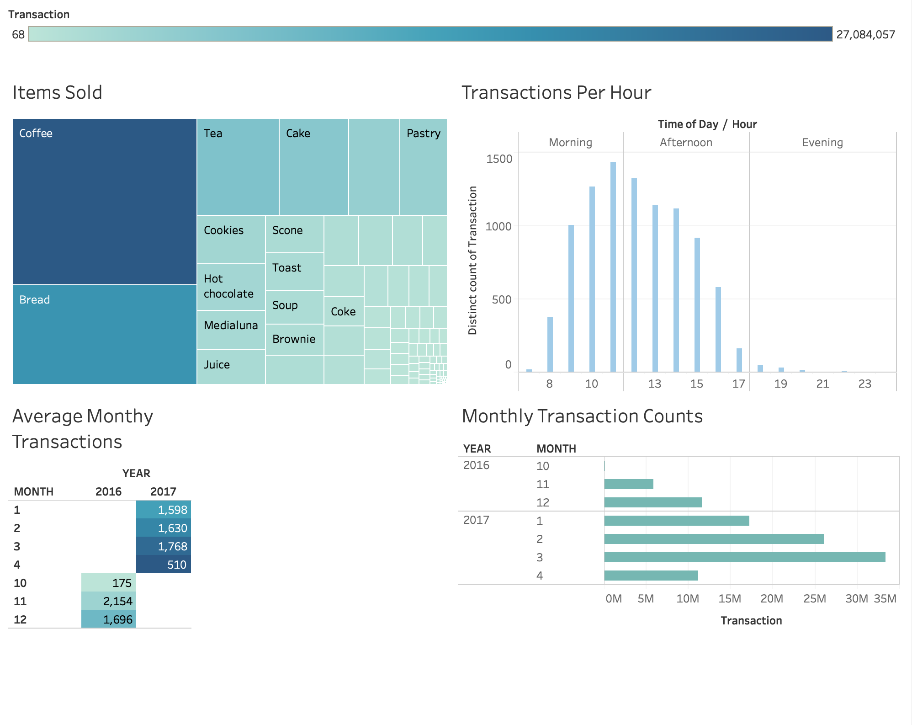

# Understanding Data with Tableau

I have displayed a few Tableau Dashboard using public datasets below. You can find each Tableau Workbook within the "Workbook" directory in this repo. Feel free to check out images of the dashboards below, and download any workbook that interests you. I also included SQL queries to wrangle the data into the correct representation.

#### Transaction Dashboard

- Workbook Name: Breaking Bread Dashboard
- Dataset: [Bread Basket](https://www.kaggle.com/xvivancos/transactions-from-a-bakery)

This dataset contained transaction information on item purchases from a bakery for six month period in late 2016 and early 2017. I only use the 2017 data to construct a simple dashboard showing us the top item sold from the bakery, the frequency of transaction concerning the time of the day, the total transactions per week in 2017, and a leaderboard of the most common item baskets we see our customer's purchase. This is a really simple dashboard that can be made if you have market basket data with time series information.

#### Crypto Currency Timeline

  - Workbook Name: Crypto Currency Timeline
  - Dataset: [Cryptocurrency Historical Prices](https://www.kaggle.com/sudalairajkumar/cryptocurrencypricehistory)
    - A dataset containing the volume, market cap, and opening/closing prices every Crypto Currency coin.
